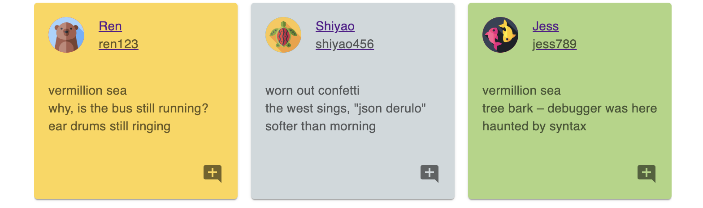

### Phase 4 Full-Stack Application Project 
# HaiKu

## User Stories
---
Welcome to Haiky, the ultimate platform for haiku enthusiasts and poets alike!

Our intuitive app is designed to be your poetic sanctuary, where you can effortlessly compose and share your haikus with fellow wordsmiths. Whether you're a seasoned haiku master or a budding poet, appname provides the perfect canvas for your lyrical expressions.

As a user, you will be able to:
* Sign up for an account
* Log in to the site and remain logged in
* Log out
* Edit your own profile
* View all the haiku post
* Create a new haiku and publish it
* delete your own post
* Like a haiku or cancel your like
* Add a review to a haiku post, or even like/unlike other's review
* Check people's profile page


## Table Setup
---

The file server/models.py defines the model classes without relationships. Use the following commands to create the initial database app.db:
```bash
export FLASK_APP=server/app.py
flask db init
flask db upgrade head
```

## Wireframe
---
