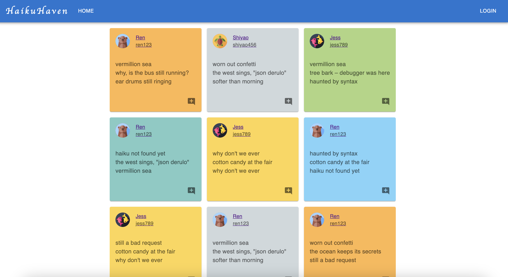

# Haiku Haven

👋 hai there! Haiku Haven is a social network where you can effortlessly compose and share your haikus with fellow wordsmiths.

## User Stories
---

As a user, you will be able to:
* Sign up for an account
* Log in to the site and remain logged in
* Log out
* Edit your own profile
* View other user profiles 
* View all the haiku posts
* Create a new haiku and publish it
* Delete your own post
* Like a haiku or remove your like
* Add a comment to a haiku post, or even like/unlike other's comment

## References and Acknowledgements
[Securing your session key](https://morgvanny.com/securing-your-session-key-in-flask/) 
[Animal icons created by Freepik - Flaticon](https://www.flaticon.com/free-icons/animal) 
[Implement following/followers](https://stackoverflow.com/questions/23622922/how-to-implement-following-followers-relationship-in-sqlalchemy)
